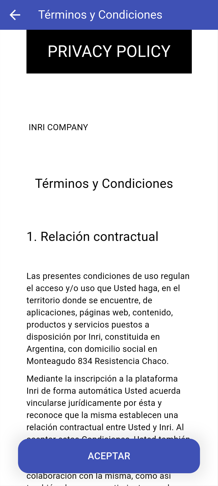
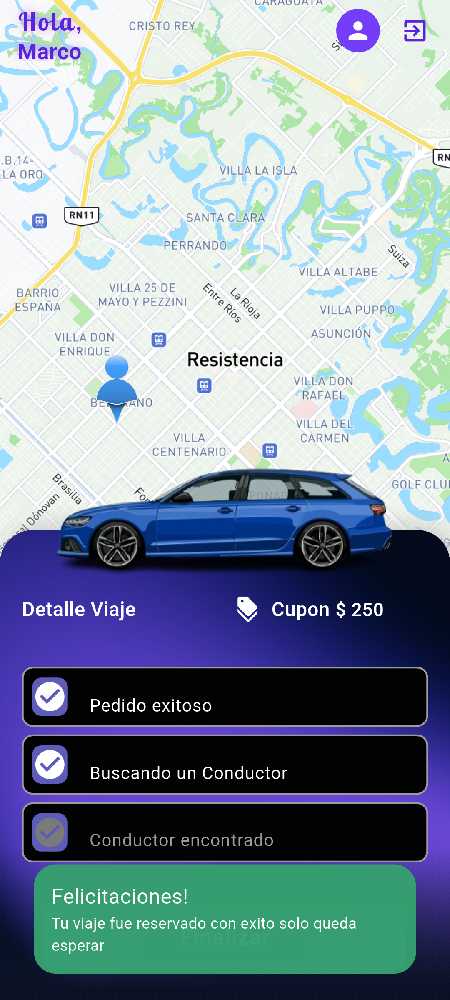

# 🚕 Usuario INRI - App de Viajes Tipo Uber

Aplicación móvil desarrollada con Flutter inspirada en la lógica de Uber, donde los usuarios pueden solicitar viajes y seguir el estado del conductor en tiempo real.

---

## 📱 Características

- Registro e inicio de sesión de usuarios  
- Solicitud de viajes  
- Asignación dinámica de conductores  
- Seguimiento en tiempo real en el mapa  
- Finalización del viaje  
- Notificaciones visuales personalizadas (SnackBars)  
- Estado persistente con Hydrated Bloc  

---

## 🛠️ Tecnologías

- **Flutter** (Frontend)  
- **Dart** (Lógica)  
- **Node.js + Express** (Backend)  
- **MongoDB** (Base de datos)  
- **Hydrated Bloc** para manejo de estado persistente  
- **Mapbox** para mapas  

---

## 🚀 Instalación local

1. Cloná el proyecto:

   ```bash
   git clone https://github.com/tu-usuario/usuarios_uber.git
   cd usuarios_uber
   ```

2. Instalá las dependencias:

   ```bash
   flutter pub get
   ```

3. Configurá tu backend en:

   ```
   lib/global/environment.dart
   ```

4. Ejecutá la app:

   ```bash
   flutter run
   ```

---

## 🔐 Seguridad

- Implementación futura de mTLS, WAF y firewalls personalizados  
- Tokens protegidos  
- Persistencia controlada de información  

---
## 📷 Capturas de pantalla

### Splash screen


### Inicio de sesión


### Politicas de Privacidad


### Registro de Usuario


### Home de la app sin solicitudes


### Home de la app con orden en proceso


### Home de la app con conductor asignado


---
## 📬 Contacto

**Luis Leonidas Fernández**  
Flutter Developer (Chaco, Argentina)  
📧 Email: fernandezluis303@gmail.com  
🌐 GitHub: [https://github.com/Luis-Leonidas-Fernandez](https://github.com/Luis-Leonidas-Fernandez)

